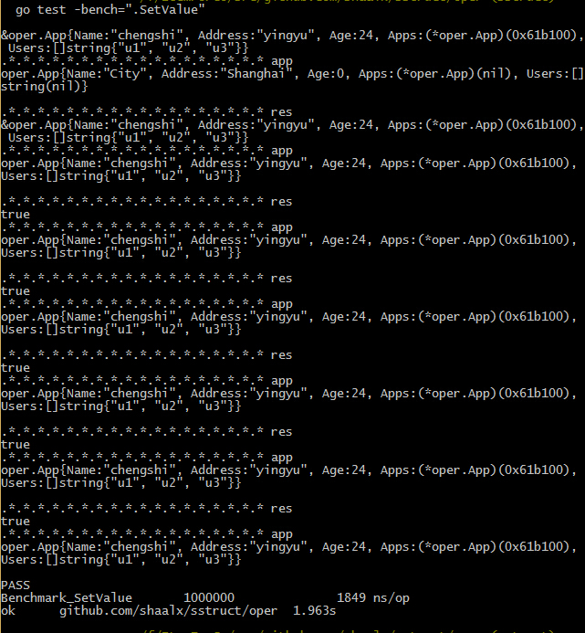

##TEST LOG

* 地址与值.传地址，可以改变原来的值；传值只可以改变副本。

> code：

	1. 传递地址，可以改变源

	func SetValueOfPtr(instance interface{}, value []interface{}) interface{} {
		kind := reflect.TypeOf(instance).Kind()
		if reflect.Ptr != kind {
			return nil
		}
		elem := reflect.ValueOf(instance).Elem()
		fmt.Println(elem.NumField())
		for i, v := range value {
			elem.Field(i).Set(reflect.ValueOf(v))
		}
		return instance
	}

	2. 传递值，仅改变副本

	func SetValueOfCopy(instance interface{}, value []interface{}) interface{} {
		kind := reflect.TypeOf(instance).Kind()
		if reflect.Ptr == kind {
			return nil
		}
		newInstance := reflect.New(reflect.TypeOf(instance))
		app := newInstance.Interface()
		elem := reflect.ValueOf(app).Elem()
		fmt.Println(elem.NumField())
		for i, v := range value {
			elem.Field(i).Set(reflect.ValueOf(v))
		}
		return app
	}
* 结构体属性若无另一个结构体的属性，传递值一切OK，传递指针panic。
传递自身指针会引起panic，其他不会哦！！

* 构造好的变量，如何复制给结构体变量呢？ 只可能自己重新定义结构体，属性类型为interface{}，而且接收的值一定为地址，如*main.App

* 反射可破坏结构体内部结构，如指针构造时：
	reflect.ValueOf(&instance).Elem().Set(reflect.ValueOf(value))
	值将直接覆盖该结构体块。

